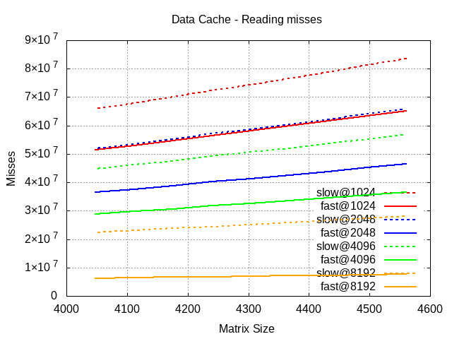
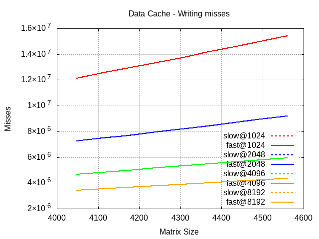
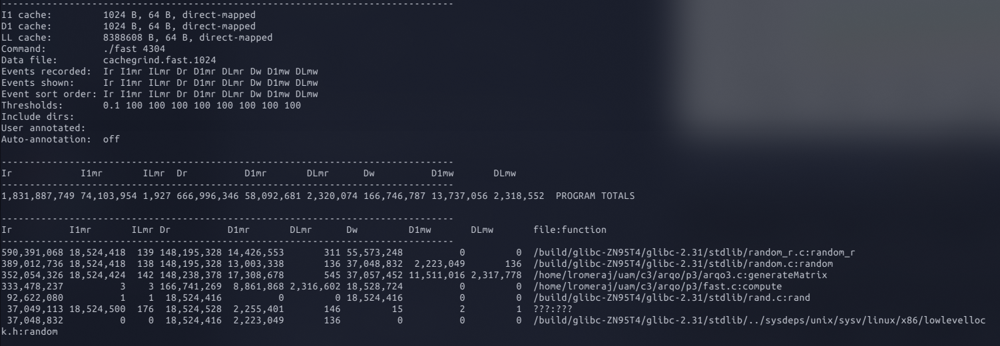
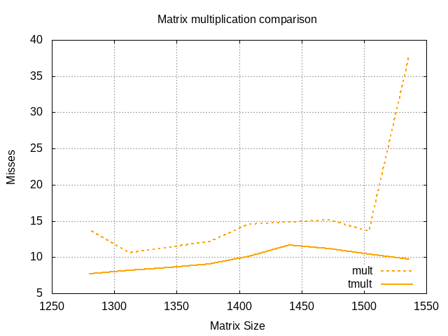

Javier Romera Llave  
Álvaro Rodríguez Palacios  
# ARQO | P3

### Ejercicio 0

``` 
LEVEL1_ICACHE_SIZE                 32768
LEVEL1_ICACHE_ASSOC                8
LEVEL1_ICACHE_LINESIZE             64
LEVEL1_DCACHE_SIZE                 49152
LEVEL1_DCACHE_ASSOC                12
LEVEL1_DCACHE_LINESIZE             64
LEVEL2_CACHE_SIZE                  524288
LEVEL2_CACHE_ASSOC                 8
LEVEL2_CACHE_LINESIZE              64
LEVEL3_CACHE_SIZE                  6291456
LEVEL3_CACHE_ASSOC                 12
LEVEL3_CACHE_LINESIZE              64
LEVEL4_CACHE_SIZE                  0
LEVEL4_CACHE_ASSOC                 0
LEVEL4_CACHE_LINESIZE              0
```

El PC en el que estamos trabajando tiene tres niveles de memoria caché, en el primer nivel podemos observar una caché asociativa de 8 vías para las instrucciones y una caché asociativa de 12 vías para los datos, en el segundo nivel tenemos una caché asociativa de 8 vías y en el último nivel una caché asociativa de 12 vías.

### Ejercicio 1

**1.2)** La razón principal es porque el programa que estamos utilizando no es el único programa que se está ejecutando en ese momento (al menos en nuestro entorno de trabajo), el sistema operativo que gestiona los procesos puede que haya decidido en algún momento de la ejecución de nuestro programa saltar o continuar otro proceso, es decir, está intercalando la ejecución de los disintos procesos que haya en ese momento. Y es por esto que para una misma matriz y la misma forma de recorrerla obtenemos ligeras oscilaciones en los tiempos, una buena forma de aproximar estos tiempos es usando una media aritmética.

**1.5)** 
Cuando las matrices son relativamente pequeñas no se aprecia prácticamente diferencia en la forma de recorrerlas ya que al ser pequeñas caben casi completamente en la caché, pero en el momento que aumentamoes el tamaño de las matrices la diferencia entre los tiempos comienza a incrementarse, y es aquí cuando influye mucho la forma en la que recorremos la matriz, si los datos los leemos de tal forma que estos estén contiguos evitamos que la caché tenga que acceder más veces a la memoria principal para volcar los bloques, en cambio, cuando accedemos de tal forma que por cada iteración accedemos a direcciones (lo suficientemente lejanas) como para que el índice del bloque de la caché se pise muchas veces, repercutirá de tal forma que los accesos a memoria principal serán muhco mayores.

La matriz se está guardando en memoria por columnas.


### Ejercicio 2

**2.4)**

En el caso de la versión `slow` del programa la tendencia no varía prácticamente nada al modificar el tamaño de la caché, es decir, la pendiente de las rectas que forman los datos son casi siempre iguales, en cambio en la versión `fast` del programa la tendencia de estas rectas si varía bastante más, llegando a aplanarse bastante como podemos apreciar en el siguiente gráfico:


Si ahora comparamos las dos versiones fijándonos en un tamaño específico de la caché, podemos observar que la versión `fast` del programa siempre está mucho más por debajo de la versión `slow` y con una pendiente mucho más suave.

Si observamos el gráfico de escrituras:
  

Se puede apreciar que las rectas de la versión `slow` y `fast` están superpuestas, para ver el por qué de esto podemos fijarnos en el análisis de la emulación con el comando `cg_annotate`:
  

Se puede apreciar que la función `compute` que es la que suma todos los elementos de la matriz, no ha provocado ningún fallo de escritura en la caché de datos de nivel 1.
Dado que ninguna de las dos versiones de la función realiza la acción de escribir en memoria principal y el resto del programa es idéntico no de aprecian diferencias entre ambas versiones.

### Ejercicio 3

**3.5)** Viendo la gráfica del tiempo:
  

Podemos ver que el segundo método (usando la matriz traspuesta) es mucho más eficiente. La gráfica presenta múltiples picos debido a que las pruebas no se realizaron el suficiente número de veces, pero aún así se puede ver como las variaciones son mucho menores usando la matriz traspuesta.

