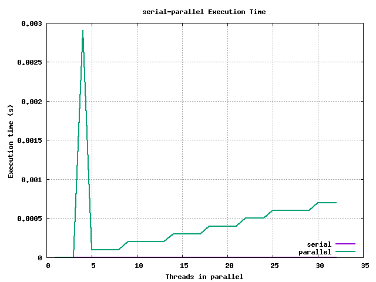
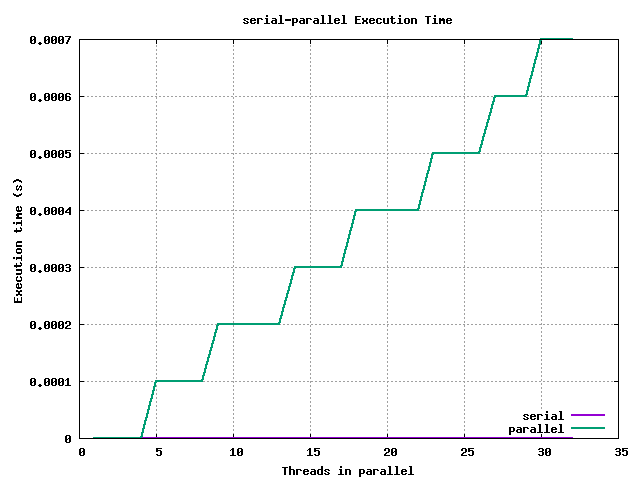
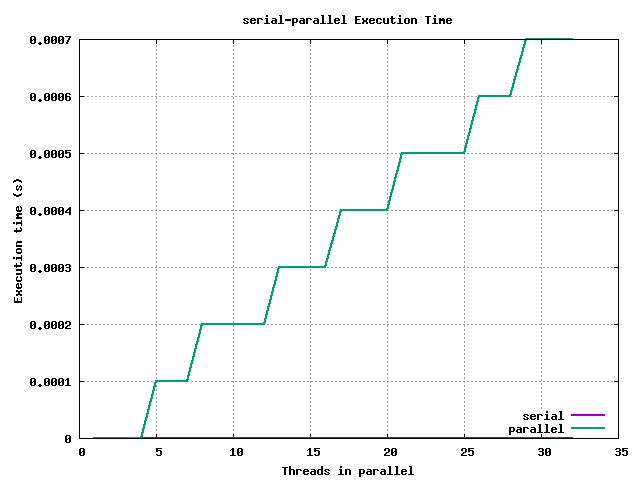
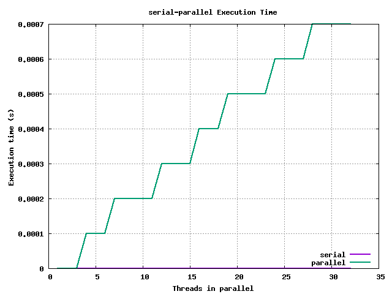
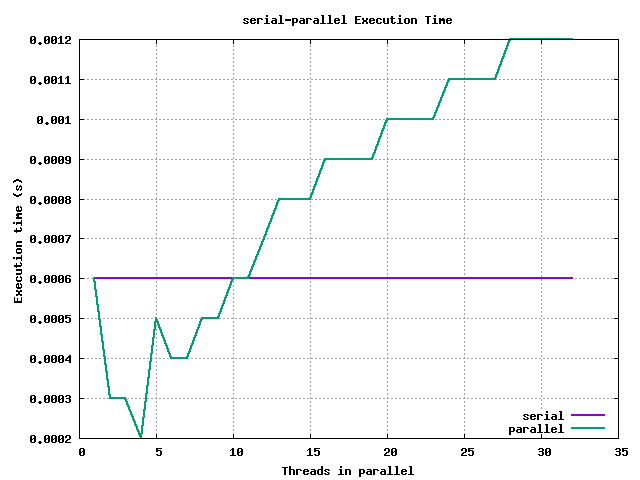
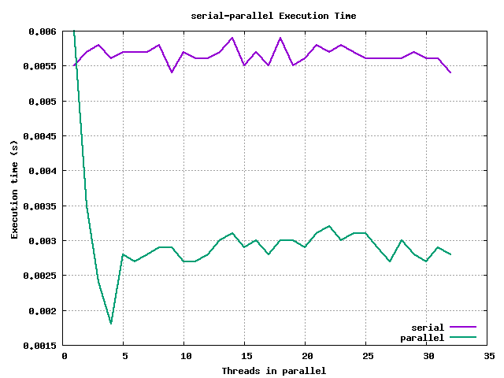
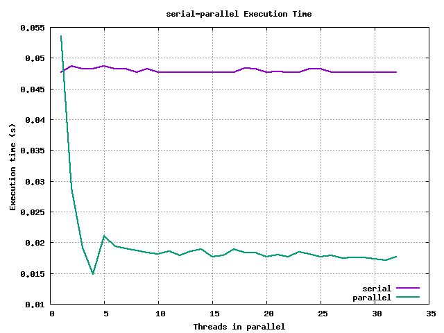

# ARQUITECTURA - PRÁCTICA 4

Autores:
  - Álvaro Rodríguez Palacios
  - Javier Romera Llave


## Sobre el desarrollo de la práctica

La práctica será desarrollada en un directorio local, pero las pruebas se ejecutarán en el cluster, por lo que a continuación expondremos - como se pide en el _ejercicio 0_ - la información relativa a la arquitectura de la máquina con la que estamos trabajando.

## Ejercicio 0 - Información sobre la topología del sistema

Para ello, ejecutamos:

  ```
  cat /proc/cpuinfo
  ```

Y de ahí, podemos observar que el nodo del cluster en el que estamos trabajando
tiene las siguientes características:

  - Procesador AMD Opteron 6128
    - 8 cores con hyperthreading activado
    - 8 threads por defecto, 16 con hyperthreading
    - 3 niveles de Caché:
      - Caché L1:
        - 8 x 64 KB Asociativa de 2 vías INSTRUCCIONES
        - 8 x 64 KB Asociativa de 2 vías DATOS
      - Caché L2:
        - 8 x 512 KB Asociativa de 16 vías Exclusive
      - Caché L3:
        - 2 x 6 MB compartida Exclusive
    - TLB de 1024 entradas con páginas de 4KB
    - 48 bits direccionamiento físico
    - 48 bits direccionamiento virtual

## Ejercicio 1 - Programas básicos de OpenMP

Sobre las preguntas formuladas:

> 1.1 ¿Se pueden lanzar más _threads_ que _cores_ tenga el sistema? ¿Tiene sentido hacerlo?

Por supuesto que se puede, sólo que serán encoladas por el sistema operativo. Es decir, el máximo que se podrán ejecutar concurrentemente serán las dadas por las funciones ´omp_get_num_procs()´ en los cores, sin _hyperthreading_, y ´omp_get_max_threads()´ con _hyperthreading_ activo, y esto contando con que en ese momento no se estén lanzando programas distintos - ya que, generalmente, en un sistema operativo siempre hay varios procesos ejecutándose.

Para poder ver esto con mayor claridad, podríamos ejecutar en sistemas Unix - o Unix compatibles - la instrucción `ps -ef`, lo que nos mostraría todos los hilos que están o tienen que ejecutarse, a nivel de sistema operativo - y manejados por este. Por lo que, en caso de necesitar un alto grado de multiprogramación, podría ser muy útil hacerlo de esta manera, y dejar que el sistema operativo se encargue de pasarlos a ejecución - aunque, en caso de que haya tareas que consuman pocos ciclos de procesador, quizá esta opción no sea muy eficaz, dado que habría una sobrecarga excesiva para la poca tarea que cada hilo tendría.

> 1.2 ¿Cuántos _threads_ debería utilizar en los ordenadores del laboratorio? ¿Y en el cluster? ¿Y en su propio equipo?

Disclaimer: no hemos podido utilizar los ordenadores del laboratorio para esta práctica.

En el cluster, según hemos expuesto anteriormente, y según el retorno de la función `omp_get_max_threads()`, el máximo número de hilos que tendríamos que ejecutar en paralelo sería 16.

En el equipo propio en que estamos desarrollando la práctica - localmente, según hemos dicho en la [introducción](#sobre-el-desarrollo-de-la-práctica) - es un AMD Ryzen 5 2500u, de 4 cores físicos y 8 threads, por lo que deberíamos ejecutarlo con 8 hilos como mucho - siempre que no se den condiciones que forzasen a aumentar o reducir el grado de la multiprogramación, como hemos visto en el apartado anterior.

> 1.3 Modifique el programa omp1.c para utilizar las tres formas de elegir el número de threads y deduzca la prioridad entre ellas

Tal y como hemos podido ver, la variable de entorno _OMP_NUM_THREADS_ sólo se usa en el valor de _nthreads_ que hay dentro de la región paralela, no trascendiendo fuera de ese bloque; siendo la función _omp_set_num_threads(any)_ la que cambia el valor de la variable _nthreads_ en todo momento - dentro y fuera de las regiones paralelas.

Por otro lado, tenemos la cláusula _num_threads(any)_ en la línea de la directiva `#pragma`, cuyo orden de precedencia es mayor que los anteriores, quedando la prioridad de las 3 clásulas definidas como sigue:

  1. num_threads(any)
  2. omp_set_num_threads(any)
  3. OMP_NUM_THREADS = any

> 1.4 ¿Cómo se comporta OpenMP cuando declaramos una variable privada?

Las variables declaradas como _private(var)_ en la directiva `#pragma` se comportan, dentro de esa región, como si estuviesen declaradas como **static** en el bloque de código de la región paralela, con la diferencia de que han sido declaradas fuera - ya que **static** significa, entre otras cosas, un almacenamiento estático temporal en un bloque de código (ver [The Keyword 'Static'](http://scc-forge.lancaster.ac.uk/open/char/lang/static)).

> 1.5 ¿Qué ocurre con el valor de una variable privada al comenzar a ejecutarse en la región paralela?

Según el punto anterior, se observa que el valor de la variable al comienzo de una región paralela es equivalente a tener, al principio de ese bloque de código, lo siguiente:

  ```
  static int a;
  printf("Valor de a: %d\n", a);
  ```

Es decir, una variable **sin** inicializar.

> 1.6 ¿Qué ocurre con el valor de una variable privada al finalizar la región paralela?

Tal y como hemos expuesto en el apartado anterior, el valor de la variable privada es perecedera, siendo sus modificaciones invisibles para el código externo, por lo que al finalizar el bloque de código el valor permanece intacto.

> 1.7 ¿Ocurre lo mismo con las variables públicas?

No, ya que estas se comportan como una variable 'normal', toda modificación que sufra antes, durante y después de la/las región/es paralela(s) se conservará para el/los siguiente(s) bloque(s) de código.


## Ejercicio 2 - Paralelizar el producto escalar

Sobre las preguntas propuestas:

> 2.1 Ejecute la versión serie y entienda cuál debe ser el resultado para diferentes tamaños de vector.

No hay demasiada variación de tiempo para incrementos de hasta 3 órdenes de magnitud en la directiva `#define M 10...0ull`, variando entre órdenes de 10⁶ y 10⁸; sin pasarnos del máximo que soporta un número en coma flotante, puesto que habría overflow, con O(N) ya que son vectores lineales, por lo que el crecimiento y la diferencia de tiempo tiende a ser lineal - ~ del orden de 10³, razonable para la variación de tamaño de ambos vectores.

Para un tamaño de vector `M=10000000` obtenemos:

```
Resultado: 10000000.000000
Tiempo: 0.045901
```

Para un tamaño de vector `M=10000` obtenemos:

```
Resultado: 10000.000000
Tiempo: 0.000066
```

Para un tamaño de vector `M=10` obtenemos:

```
Resultado: 10.000000
Tiempo: 0.000000
```

En el último caso, vemos que es despreciable; para los demás - los otros dos - observamos una tendencia razonable, puesto que si aumentamos el tamaño del vector en O(10³), el tiempo crece en ese mismo orden. Sobre el resultado calculado, también es el correcto (coincide).

> 2.2 Ejecute el código paralelizado con el pragma openmp y conteste en la memoria a las siguientes preguntas:
>
> - ¿Es correcto el resultado?
> - ¿Qué puede estar pasando?

Para un tamaño de vector `M=10000000` obtenemos:

```
Resultado: 3766997.000000
Tiempo: 0.508582
```

Para un tamaño de vector `M=10000` obtenemos:

```
Resultado: 3417.000000
Tiempo: 0.000540
```

Para un tamaño de vector `M=10` obtenemos:

```
Resultado: 8.000000
Tiempo: 0.000082
```

Como podemos observar, hay una disparidad de resultados - sin embargo, el tiempo parece ser algo razonable, teniendo en cuenta también lo expuesto [arriba](#ejercicio-1---programas-básicos-de-openmp) - que nos hacen ver que los cálculos no están siendo acertados. La razón de esto es la concurrencia, y es que el programa base _pescalar_par1.c_ no protege las variables en lectura y escritura, por lo que en la instrucción:

`sum = sum + A[k]*B[k]`

se están utilizando valores de `sum` que pueden no haber sido actualizados aún por esa misma instrucción - per de otro hilo. Con esto, en los siguientes puntos veremos cómo resolverlo.

> 2.3 Modifique el código anterior y denomine el programa pescalar_par2. Esta versión deber dar el resultado
> correcto utilizando donde corresponda alguno de los siguientes pragmas
> 
> #pragma omp critical
> 
> #pragma omp atomic 
> 
> ¿Puede resolverse con ambas directivas? Indique las modificaciones realizadas en cada caso.
> 
> ¿Cuál es la opción elegida y por qué?

Vamos a repetir la prueba sólo para un caso, el de `M=10000`.

Primero, con la solución de `#pragma omp critical`:
 
```
Resultado: 10000.000000
Tiempo: 0.003124
```

Como vemos, ahora el resultado sí es el esperado.

Probando con la directiva `#pragma omp atomic` nos encontramos con un error, debido a que ésta sólo permite ser utilizada en los siguientes casos (ver: [omp atomic](https://scc.ustc.edu.cn/zlsc/sugon/intel/compiler_c/main_cls/cref_cls/common/cppref_pragma_omp_atomic.htm)):

```
x binop= expr
x++
++x
x--
--x
```

Para solucionar esto, hay que reescribir la siguiente expresión:

`sum = sum + A[k]*B[k];` --> `sum += A[k]*B[k];`

Siendo el resultado el siguiente:

```
Resultado: 10000.000000
Tiempo: 0.001886
```

Estas dos soluciones requieren poner la directiva en la línea anterior a la operación, dentro del bucle _for_.

Hemos elegido `atomic` antes que `critical` por una razón, y es que, como se puede ver en la referencia que hemos dejado arriba, `atomic` hace referencia a un acceso a una parte concreta de memoria, mientras que `critical` se refiere a un bloque entero (ver [omp critical](https://scc.ustc.edu.cn/zlsc/tc4600/intel/2015.1.133/compiler_c/GUID-0C42D422-7CF5-44A7-AC12-43DF3CBD65A1.htm)); siendo más precisa la solución con `atomic` en este caso, pese a que tenga que modificarse la expresión.

La idea aquí de `#pragma omp atomic` es similar a la de los tipos `atomic` en **C** (ver [Atomics](http://scc-forge.lancaster.ac.uk/open/char/threads/atomic))

> 2.4 Modifique el código anterior y denomine el programa resultante pescalar_par3. Esta versión debe dar el
> resultado correcto utilizando donde corresopnda alguno de los siguientes pragmas.
>
> #pragma omp parallel for reduction
>
> - Comparando con el punto anterior. ¿Cuál es la opción elegida y por qué?

Además de las anteriores,  posible solución sería declarando la directiva #pragma como sigue:

```
#pragma omp parallel for reduction(+:sum)
```

con el siguiente resultado:

```
Resultado: 10000.000000
Tiempo: 0.000105
```

Aquí, vemos que hemos usado la cláusula `reduction`, específica para regiones paralelas de compartición de datos, que tiene que ser usada junto con `parallel for` - no aisladamente, ya que sería ignorada por el compilador y tendríamos una zona de acceso inseguro a los datos -, indicando los términos de la operación (aquí: '+:sum').

Respecto al tiempo necesitado para ejecutarse, vemos que obtiene un tiempo de ejecución de 1 orden de magnitud inferior respecto a `critical` y `atomic`, puesto que en el caso de la directiva `#pragma omp atomic` requiere que cada _thread_ se sincronice, por lo que se tienen que serializar los _threads_; por otro lado, `#pragma omp for reduction` utiliza algoritmos de reducción en paralelo (ver: [Parallel patterns reduce & scan](https://courses.cs.washington.edu/courses/csep506/11sp/slides/Lecture-6-Parallel-Patterns.pdf))

Así que, con esto, nuestra solución para **pescalar_par3.c** es utilizar la directiva `#pragma omp for reduction(+:sum)`

> 2.6 Análisis de tiempos de ejecución

Vamos a utilizar la versión **pescalar_serie.c** junto con su versión paralela **pescalar_par3.c** en este caso - la que nosotros consideramos como mejor solución.

Los tamaños del vector serán los siguientes:

 -> 1000 -> 10000 -> 100000 -> 10000000 -> 100000000

Empezando en N=1000, con incrementos de N=N+N*10, hasta N=100000000.

Sacando una media de tiempo para N=1000 de t ~ 6e-5s, para N=100000000 t ~ 4.6e-1s. 4 órdenes de diferencia de tiempo para 8 órdenes de diferencia de tamaño.

Estos datos son previos, y sólo nos van a servir para poder justificar, a priori, los tamaños de vector elegido. Los datos finales se exponen a continuación.

**Las gráficas generadas se encuentran en la carpeta ex2/img_a/. Los datos desde los que se generan están en la carpeta ex2/data_a/**

El nombre de las imágenes tiene un número, que hace referencia al tamaño del vector que se ha ejecutado en ese caso, y en la gráfica se va incrementando en el eje horizontal el número de hilos que se lanzan (aunque en el caso de _serial_ siempre sea **0**). Se han generado entre 1 y 32 - puesto que con hyperthreading hay 16 cores, 2 * 16 = 32 - y una variación de tamaño de vector de entre 10 hasta 10000000 en incrementos de (N*10), obteniendo 6 tamaños distintos de vector. Para cada tamaño de vector y cada número de hilos se toman 20 datos, y se hace la media de todos ellos.

Para N=10 se tiene:



Para N=100 se tiene:



Para N=1000 se tiene:



Para N=10000 se tiene:



Para N=100000 se tiene:



Para N=1000000 se tiene:



Para N=10000000 se tiene:



En ellas se puede ver que según se va incrementando el tamaño del vector, es mejor la opción de multiprogramación, al igual que con el número de threads lanzados. La mejor opción para un grado alto de multiprogramación es tener tamaños grandes de vectores con un número alto de threads.

Sobre las siguientes cuestiones:

> En términos del tamaño de los vectores, ¿compensa siempre lanzar hilos para realizar el trabajo en paralelo, o hay casos en los que no?

> Si no compensa siempre, ¿en qué casos no compensa y por qué?

Siempre que se trabajen con tamaños muy reducidos de vectores, no compensa, pues se genera una sobrecarga de gestión de hilos que supera al tiempo que pueden ganar en la ejecución - y en el peor de los casos, si son muchos hilos, harán que el sistema operativo tarde más en ejecutar todos - por lo que no sería un caso en el que favoreciese eso.

> ¿Se mejora siempre el rendimiento al aumentar el número de hilos a trabajar?

No, ya que para casos favorables - tamaños de datos grandes -, si generamos un número de hilos muy superior al máximo que puedan ejecutarse en paralelo, lo que se consigue es que el sistema operativo tenga que encargarse de lanzarlos, pudiendo ralentizar la ejecución debido a la sobrecarga añadida.

Esto se observa claramente en las gráficas de 10 < N < 10000, donde por cada más hilos que se lanzan, más tiempo tarda para un mismo tamaño de vector.

> Si no fuera así, ¿a qué se debe este efecto?

Ya ha sido contestado en el apartado anterior

> Valore si existe algún tamaño de vector a partir del cual el comportamiento de la aceleración va a ser muy diferente al obtenido en la gráfica.

Se puede pensar que para vectores de órdenes de magnitud suficientes, puesto que la gráfica no se ve clara, y por más que se repitan las pruebas, para O(10¹) - O(10⁴), siguen siendo favorables los casos de **serial**.

Sin embargo, para O(10⁵) la gráfica, con pocos hilos, muestra mejores resultados para **parallel**, mientras que para muchos hilos no.

A partir de O(10⁶), el caso de **parallel** toma ventaja y se mantiene así para tamaños de vector más grandes (nótese el caso de O(10⁷), que obtiene un resultado más estable el en el orden inferior).

> Modifique el código de la versión paralela para que sólo se ejecute en paralelo cuando el tamaño de vector sea lo suficientemente grande y justifique la ejecución en paralelo. Para ello utilice la cláusula `if(expression)` dentro del pragma:
>
> `#pragma omp parallel if (M>valor)`

Si se desea ejecutar sin esta versión, se deberá eliminar dicha parte de la cláusula del bucle for en el ficher **pescalar_par3.c**.

Las gráficas, si se generasen en este caso, se superpondrían hasta que superasen el umbral definido en **pescalar_par3.c**, que es del valor = 50000; en nuestro caso sería a partir de vectores de tamaño >= 100000 (según nuestro _script_). Una vez superado ese umbral, las gráficas serían favorables para los casos de multiprogramación, tal y como se puede ver en las gráficas anteriores.

## Ejercicio 3 - Paralelizar la multiplicación de matrices


