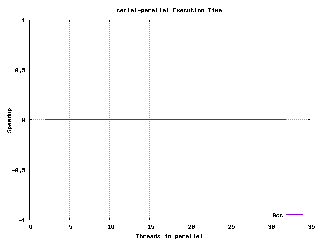
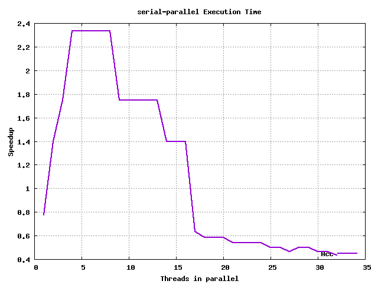
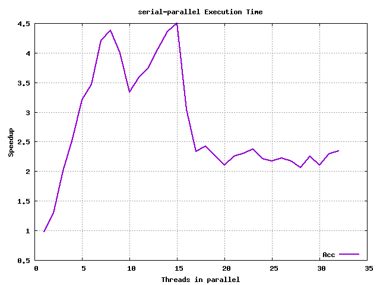
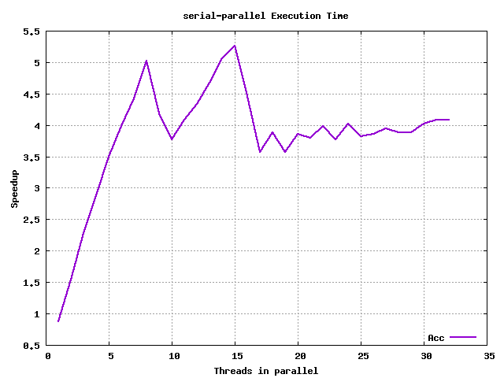
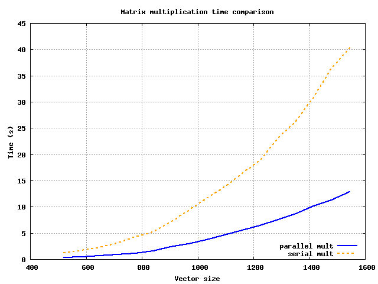
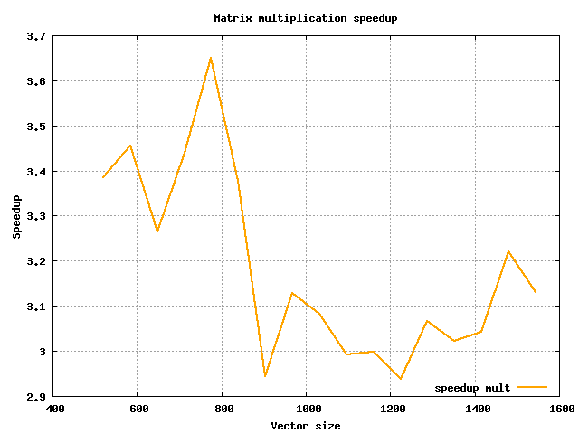

# ARQUITECTURA DE ORDENADORES - PRÁCTICA 4

Autores:
  - Álvaro Rodríguez Palacios
  - Javier Romera Llave


## Sobre el desarrollo de la práctica

La práctica será desarrollada en un directorio local, pero las pruebas se ejecutarán en el cluster, por lo que a continuación expondremos - como se pide en el _ejercicio 0_ - la información relativa a la arquitectura de la máquina con la que estamos trabajando.

## Ejercicio 0 - Información sobre la topología del sistema

Para ello, ejecutamos:

  ```
  cat /proc/cpuinfo
  ```

Y de ahí, podemos observar que el nodo del cluster en el que estamos trabajando
tiene las siguientes características:

  - Procesador AMD Opteron 6128
    - 8 cores con hyperthreading activado
    - 8 threads por defecto, 16 con hyperthreading
    - 3 niveles de Caché:
      - Caché L1:
        - 8 x 64 KB Asociativa de 2 vías INSTRUCCIONES
        - 8 x 64 KB Asociativa de 2 vías DATOS
      - Caché L2:
        - 8 x 512 KB Asociativa de 16 vías Exclusive
      - Caché L3:
        - 2 x 6 MB compartida Exclusive
    - TLB de 1024 entradas con páginas de 4KB
    - 48 bits direccionamiento físico
    - 48 bits direccionamiento virtual

## Ejercicio 1 - Programas básicos de OpenMP

Sobre las preguntas formuladas:

> 1.1 ¿Se pueden lanzar más _threads_ que _cores_ tenga el sistema? ¿Tiene sentido hacerlo?

Por supuesto que se puede, sólo que serán encoladas por el sistema operativo. Es decir, el máximo que se podrán ejecutar concurrentemente serán las dadas por las funciones ´omp_get_num_procs()´ en los cores, sin _hyperthreading_, y ´omp_get_max_threads()´ con _hyperthreading_ activo, y esto contando con que en ese momento no se estén lanzando programas distintos - ya que, generalmente, en un sistema operativo siempre hay varios procesos ejecutándose.

Para poder ver esto con mayor claridad, podríamos ejecutar en sistemas Unix - o Unix compatibles - la instrucción `ps -ef`, lo que nos mostraría todos los hilos que están o tienen que ejecutarse, a nivel de sistema operativo - y manejados por este. Por lo que, en caso de necesitar un alto grado de multiprogramación, podría ser muy útil hacerlo de esta manera, y dejar que el sistema operativo se encargue de pasarlos a ejecución - aunque, en caso de que haya tareas que consuman pocos ciclos de procesador, quizá esta opción no sea muy eficaz, dado que habría una sobrecarga excesiva para la poca tarea que cada hilo tendría.

> 1.2 ¿Cuántos _threads_ debería utilizar en los ordenadores del laboratorio? ¿Y en el cluster? ¿Y en su propio equipo?

Disclaimer: no hemos podido utilizar los ordenadores del laboratorio para esta práctica.

En el cluster, según hemos expuesto anteriormente, y según el retorno de la función `omp_get_max_threads()`, el máximo número de hilos que tendríamos que ejecutar en paralelo sería 16.

En el equipo propio en que estamos desarrollando la práctica - localmente, según hemos dicho en la [introducción](#sobre-el-desarrollo-de-la-práctica) - es un AMD Ryzen 5 2500u, de 4 cores físicos y 8 threads, por lo que deberíamos ejecutarlo con 8 hilos como mucho - siempre que no se den condiciones que forzasen a aumentar o reducir el grado de la multiprogramación, como hemos visto en el apartado anterior.

> 1.3 Modifique el programa omp1.c para utilizar las tres formas de elegir el número de threads y deduzca la prioridad entre ellas

Tal y como hemos podido ver, la variable de entorno _OMP_NUM_THREADS_ sólo se usa en el valor de _nthreads_ que hay dentro de la región paralela, no trascendiendo fuera de ese bloque; siendo la función _omp_set_num_threads(any)_ la que cambia el valor de la variable _nthreads_ en todo momento - dentro y fuera de las regiones paralelas.

Por otro lado, tenemos la cláusula _num_threads(any)_ en la línea de la directiva `#pragma`, cuyo orden de precedencia es mayor que los anteriores, quedando la prioridad de las 3 clásulas definidas como sigue:

  1. num_threads(any)
  2. omp_set_num_threads(any)
  3. OMP_NUM_THREADS = any

> 1.4 ¿Cómo se comporta OpenMP cuando declaramos una variable privada?

Las variables declaradas como _private(var)_ en la directiva `#pragma` se comportan, dentro de esa región, como si estuviesen declaradas como **static** en el bloque de código de la región paralela, con la diferencia de que han sido declaradas fuera - ya que **static** significa, entre otras cosas, un almacenamiento estático temporal en un bloque de código (ver [The Keyword 'Static'](http://scc-forge.lancaster.ac.uk/open/char/lang/static)).

> 1.5 ¿Qué ocurre con el valor de una variable privada al comenzar a ejecutarse en la región paralela?

Según el punto anterior, se observa que el valor de la variable al comienzo de una región paralela es equivalente a tener, al principio de ese bloque de código, lo siguiente:

  ```
  static int a;
  printf("Valor de a: %d\n", a);
  ```

Es decir, una variable **sin** inicializar.

> 1.6 ¿Qué ocurre con el valor de una variable privada al finalizar la región paralela?

Tal y como hemos expuesto en el apartado anterior, el valor de la variable privada es perecedera, siendo sus modificaciones invisibles para el código externo, por lo que al finalizar el bloque de código el valor permanece intacto.

> 1.7 ¿Ocurre lo mismo con las variables públicas?

No, ya que estas se comportan como una variable 'normal', toda modificación que sufra antes, durante y después de la/las región/es paralela(s) se conservará para el/los siguiente(s) bloque(s) de código.


## Ejercicio 2 - Paralelizar el producto escalar

Sobre las preguntas propuestas:

> 2.1 Ejecute la versión serie y entienda cuál debe ser el resultado para diferentes tamaños de vector.

No hay demasiada variación de tiempo para incrementos de hasta 3 órdenes de magnitud en la directiva `#define M 10...0ull`, variando entre órdenes de 10⁶ y 10⁸; sin pasarnos del máximo que soporta un número en coma flotante, puesto que habría overflow, con O(N) ya que son vectores lineales, por lo que el crecimiento y la diferencia de tiempo tiende a ser lineal - ~ del orden de 10³, razonable para la variación de tamaño de ambos vectores.

Para un tamaño de vector `M=10000000` obtenemos:

```
Resultado: 10000000.000000
Tiempo: 0.045901
```

Para un tamaño de vector `M=10000` obtenemos:

```
Resultado: 10000.000000
Tiempo: 0.000066
```

Para un tamaño de vector `M=10` obtenemos:

```
Resultado: 10.000000
Tiempo: 0.000000
```

En el último caso, vemos que es despreciable; para los demás - los otros dos - observamos una tendencia razonable, puesto que si aumentamos el tamaño del vector en O(10³), el tiempo crece en ese mismo orden. Sobre el resultado calculado, también es el correcto (coincide).

> 2.2 Ejecute el código paralelizado con el pragma openmp y conteste en la memoria a las siguientes preguntas:
>
> - ¿Es correcto el resultado?
> - ¿Qué puede estar pasando?

Para un tamaño de vector `M=10000000` obtenemos:

```
Resultado: 3766997.000000
Tiempo: 0.508582
```

Para un tamaño de vector `M=10000` obtenemos:

```
Resultado: 3417.000000
Tiempo: 0.000540
```

Para un tamaño de vector `M=10` obtenemos:

```
Resultado: 8.000000
Tiempo: 0.000082
```

Como podemos observar, hay una disparidad de resultados - sin embargo, el tiempo parece ser algo razonable, teniendo en cuenta también lo expuesto [arriba](#ejercicio-1---programas-básicos-de-openmp) - que nos hacen ver que los cálculos no están siendo acertados. La razón de esto es la concurrencia, y es que el programa base _pescalar_par1.c_ no protege las variables en lectura y escritura, por lo que en la instrucción:

`sum = sum + A[k]*B[k]`

se están utilizando valores de `sum` que pueden no haber sido actualizados aún por esa misma instrucción - per de otro hilo. Con esto, en los siguientes puntos veremos cómo resolverlo.

> 2.3 Modifique el código anterior y denomine el programa pescalar_par2. Esta versión deber dar el resultado
> correcto utilizando donde corresponda alguno de los siguientes pragmas
> 
> #pragma omp critical
> 
> #pragma omp atomic 
> 
> ¿Puede resolverse con ambas directivas? Indique las modificaciones realizadas en cada caso.
> 
> ¿Cuál es la opción elegida y por qué?

Vamos a repetir la prueba sólo para un caso, el de `M=10000`.

Primero, con la solución de `#pragma omp critical`:
 
```
Resultado: 10000.000000
Tiempo: 0.003124
```

Como vemos, ahora el resultado sí es el esperado.

Probando con la directiva `#pragma omp atomic` nos encontramos con un error, debido a que ésta sólo permite ser utilizada en los siguientes casos (ver: [omp atomic](https://scc.ustc.edu.cn/zlsc/sugon/intel/compiler_c/main_cls/cref_cls/common/cppref_pragma_omp_atomic.htm)):

```
x binop= expr
x++
++x
x--
--x
```

Para solucionar esto, hay que reescribir la siguiente expresión:

`sum = sum + A[k]*B[k];` --> `sum += A[k]*B[k];`

Siendo el resultado el siguiente:

```
Resultado: 10000.000000
Tiempo: 0.001886
```

Estas dos soluciones requieren poner la directiva en la línea anterior a la operación, dentro del bucle _for_.

Hemos elegido `atomic` antes que `critical` por una razón, y es que, como se puede ver en la referencia que hemos dejado arriba, `atomic` hace referencia a un acceso a una parte concreta de memoria, mientras que `critical` se refiere a un bloque entero (ver [omp critical](https://scc.ustc.edu.cn/zlsc/tc4600/intel/2015.1.133/compiler_c/GUID-0C42D422-7CF5-44A7-AC12-43DF3CBD65A1.htm)); siendo más precisa la solución con `atomic` en este caso, pese a que tenga que modificarse la expresión.

La idea aquí de `#pragma omp atomic` es similar a la de los tipos `atomic` en **C** (ver [Atomics](http://scc-forge.lancaster.ac.uk/open/char/threads/atomic))

> 2.4 Modifique el código anterior y denomine el programa resultante pescalar_par3. Esta versión debe dar el
> resultado correcto utilizando donde corresopnda alguno de los siguientes pragmas.
>
> #pragma omp parallel for reduction
>
> - Comparando con el punto anterior. ¿Cuál es la opción elegida y por qué?

Además de las anteriores,  posible solución sería declarando la directiva #pragma como sigue:

```
#pragma omp parallel for reduction(+:sum)
```

con el siguiente resultado:

```
Resultado: 10000.000000
Tiempo: 0.000105
```

Aquí, vemos que hemos usado la cláusula `reduction`, específica para regiones paralelas de compartición de datos, que tiene que ser usada junto con `parallel for` - no aisladamente, ya que sería ignorada por el compilador y tendríamos una zona de acceso inseguro a los datos -, indicando los términos de la operación (aquí: '+:sum').

Respecto al tiempo necesitado para ejecutarse, vemos que obtiene un tiempo de ejecución de 1 orden de magnitud inferior respecto a `critical` y `atomic`, puesto que en el caso de la directiva `#pragma omp atomic` requiere que cada _thread_ se sincronice, por lo que se tienen que serializar los _threads_; por otro lado, `#pragma omp for reduction` utiliza algoritmos de reducción en paralelo (ver: [Parallel patterns reduce & scan](https://courses.cs.washington.edu/courses/csep506/11sp/slides/Lecture-6-Parallel-Patterns.pdf))

La principal ventaja de estos algoritmos de reducción es que cada _thread_ acumula su propia suma parcial, y finalmente estos valores se suman conjuntamente, por lo que no requieren de serializar los _threads_.

Así que, con esto, nuestra solución para **pescalar_par3.c** es utilizar la directiva `#pragma omp for reduction(+:sum)`

> 2.6 Análisis de tiempos de ejecución

Vamos a utilizar la versión **pescalar_serie.c** junto con su versión paralela **pescalar_par3.c** en este caso - la que nosotros consideramos como mejor solución.

Los tamaños del vector serán los siguientes:

 10 -> 100 -> 1000 -> 10000 -> 100000 -> 10000000 -> 100000000

Empezando en N=10, con incrementos de N=N+N*10, hasta N=100000000.

Sacando una media de tiempo para N=1000 de t ~ 6e-5s, para N=100000000 t ~ 4.6e-1s. 4 órdenes de diferencia de tiempo para 8 órdenes de diferencia de tamaño.

Estos datos son previos, y sólo nos van a servir para poder justificar, a priori, los tamaños de vector elegido. Los datos finales se exponen a continuación.

**Las gráficas generadas se encuentran en la carpeta ex2/img_a/ (comparativa de serial y parallel) y ex2/img_b/ (speedup). Los datos desde los que se generan están en la carpeta ex2/data_a/ y ex2/data_b/**

El nombre de las imágenes tiene un número, que hace referencia al tamaño del vector que se ha ejecutado en ese caso, y en la gráfica se va incrementando en el eje horizontal el número de hilos que se lanzan (aunque en el caso de _serial_ siempre sea **0**). Se han generado entre 1 y 32 - puesto que con hyperthreading hay 16 cores, 2 * 16 = 32 - y una variación de tamaño de vector de entre 10 hasta 10000000 en incrementos de (N*10), obteniendo 6 tamaños distintos de vector. Para cada tamaño de vector y cada número de hilos se toman 20 datos, y se hace la media de todos ellos.

Primero, observamos las gráficas en que se representan ambas opciones - serial y parallel.

Para N=10 se tiene:


Para N=100 se tiene:


Para N=1000 se tiene:


Para N=10000 se tiene:


Para N=100000 se tiene:


Para N=1000000 se tiene:


Para N=10000000 se tiene:


En ellas se puede ver que según se va incrementando el tamaño del vector, es mejor la opción de multiprogramación, al igual que con el número de threads lanzados. La mejor opción para un grado alto de multiprogramación es tener tamaños grandes de vectores con un número alto de threads.

Ahora veamos las gráficas con la aceleración conseguida - observando la consecuencia lógica de las gráficas anteriores.

Para N=10 se tiene:


Para N=100 se tiene:


Para N=1000 se tiene:



Para N=10000 se tiene:


Para N=100000 se tiene:



Para N=1000000 se tiene:



Para N=10000000 se tiene:



Sobre las siguientes cuestiones:

> En términos del tamaño de los vectores, ¿compensa siempre lanzar hilos para realizar el trabajo en paralelo, o hay casos en los que no?
>
> Si no compensa siempre, ¿en qué casos no compensa y por qué?

Siempre que se trabajen con tamaños muy reducidos de vectores, no compensa, pues se genera una sobrecarga de gestión de hilos que supera al tiempo que pueden ganar en la ejecución - y en el peor de los casos, si son muchos hilos, harán que el sistema operativo tarde más en ejecutar todos - por lo que no sería un caso en el que favoreciese eso.

> ¿Se mejora siempre el rendimiento al aumentar el número de hilos a trabajar?

No, ya que para casos favorables - tamaños de datos grandes -, si generamos un número de hilos muy superior al máximo que puedan ejecutarse en paralelo, lo que se consigue es que el sistema operativo tenga que encargarse de lanzarlos, pudiendo ralentizar la ejecución debido a la sobrecarga añadida.

Esto se observa claramente en las gráficas de 10 < N < 10000, donde por cada más hilos que se lanzan, más tiempo tarda para un mismo tamaño de vector.

> Si no fuera así, ¿a qué se debe este efecto?

Ya ha sido contestado en el apartado anterior

> Valore si existe algún tamaño de vector a partir del cual el comportamiento de la aceleración va a ser muy diferente al obtenido en la gráfica.

Se puede pensar que para vectores de órdenes de magnitud suficientes, puesto que la gráfica no se ve clara, y por más que se repitan las pruebas, para O(10¹) - O(10⁴), siguen siendo favorables los casos de **serial**.

Sin embargo, para O(10⁵) la gráfica, con pocos hilos, muestra mejores resultados para **parallel**, mientras que para muchos hilos no.

A partir de O(10⁶), el caso de **parallel** toma ventaja y se mantiene así para tamaños de vector más grandes (nótese el caso de O(10⁷), que obtiene un resultado más estable el en el orden inferior).

> Modifique el código de la versión paralela para que sólo se ejecute en paralelo cuando el tamaño de vector sea lo suficientemente grande y justifique la ejecución en paralelo. Para ello utilice la cláusula `if(expression)` dentro del pragma:
>
> `#pragma omp parallel if (M>valor)`

Si se desea ejecutar sin esta versión, se deberá eliminar dicha parte de la cláusula del bucle for en el fichero **pescalar_par3.c**.

Las gráficas, si se generasen en este caso, se superpondrían hasta que superasen el umbral definido en **pescalar_par3.c**, que es del valor = 50000; en nuestro caso sería a partir de vectores de tamaño >= 100000 (según nuestro _script_). Una vez superado ese umbral, las gráficas serían favorables para los casos de multiprogramación, tal y como se puede ver en las gráficas anteriores.

## Ejercicio 3 - Paralelizar la multiplicación de matrices

Para ejecutar esta parte, hay que ejecutar:

`make mult; ./mult <N> <option[1,2,3,4]> <#hilos (si option > 1)>`

donde _N_ hace referencia al tamaño de la matriz cuadrada y _option_ a la opción que se ejecutará:

  1. Sin paralelizar
  2. Bucle más interno
  3. Bucle intermedio
  4. Bucle externo

Primero, completamos la tabla de tiempos, después la de aceleración. Para el caso de 'Serie' hemos tomado 4 medidas y realizado la media que daba en la salida de estas. Para las demás, hemos tomado 5 medidas de las mismas.

Para el primer apartado, vamos a tomar valores con N = 2000. Los datos de salida del programa para las diferentes versiones es la siguiente:

| Versión \ #Hilos 	  |   1  	        |   2	          |   3	          |   4	            |
|-------------------- |-------------  |-------------- |-------------  |---------------  |
|       Serie         |  83.649324 	  | 83.649324  	  | 83.649324  	  | 83.649324   	  |
| Paralela - loop 1   |  102.083016   | 57.335779     | 45.732592     | 39.902324       |
| Paralela - loop 2   |  114.073157   | 53.373445     | 38.979364     | 30.391888       |
| Paralela - loop 3   |  98.250049    | 52.256980     | 35.262153     | 26.886549       |


En vista de los resultados, vemos que los mejores resultados salen al paralelizar la región más externa del bucle. Esto puede deberse principalmente a la sobrecarga que produce paralelizar los bucles internos, y es que el crecimiento de la gestión de hilos tendrá un crecimiento O(N²) en el bucle intermedio, y O(N³) en el bucle más interno. Al realizar la paralelización fuera, eliminamos este problema y disminuimos las tareas de gestión de ejecución de los hilos por el sistema operativo. Por otro lado, vemos que lanzando más hilos, la mejora se acentúa en todos los casos - a diferencia del caso **serial**, que no varía, pues no depende del grado de la multiprogramación.

Con estos datos, podemos sacar la tabla de aceleración para cada caso:

| Versión \ #Hilos 	  |   1  	        |   2	          |   3	          |   4	            |
|-------------------- |-------------  |-------------- |-------------  |---------------  |
|       Serie         |  1         	  | 1         	  | 1         	  | 1            	  |
| Paralela - loop 1   |  0.82         | 1,458937603   | 1,829096501   | 2,096352182     |
| Paralela - loop 2   |  0.733        | 1,567246109   | 2,145989965   | 2,752356945     |
| Paralela - loop 3   |  0.85139      | 1,600730161   | 2,37221261    | 3,111196011     |


> 3.1 ¿Cuál de las tres versiones obtiene peor rendimiento? ¿A qué se debe? ¿Cuál de las tres versiones obtiene el mejor rendimiento?
> ¿A qué se debe?

Ya ha sido respondido en los comentarios sobre la tabla.

> 3.2 En base a los resultados, ¿cree que es preferible la paralelización de grano fino (bucle más interno)
> o de grano grueso (bucle más externo) en otros algoritmos? 

Dependería del caso seguramente, pero en este en concreto, es preferible la paralelización de grano grueso, con tal de eliminar sobrecarga de gestión y ejecución de hilos - por OpenMP primero y por el SO después. En tal caso, se ve que es el que mayor ganancia tiene - obviando el caso en el que el número de hilos es 1, puesto que la sobrecarga empeora los resultados de la ejecución en serie.

> Tomando como referencia los tiempos de ejecución de la versión serie y el de la mejor versión paralela
> obtenida anteriormente (la mejor combinación entre las tres versiones de código, y las C posibilidades para
> el número de hilos paralelos). Tome tiempos en un fichero y realice una gráfica de la evolución del tiempo
> de ejecución y la aceleración (de la versión paralela vs serie) al ir variando el tamaño de las matrices de NxN
> para N entre 512+P y 1024+512+P (con incrementos en N de 64).

Ambas gráficas se encuentran en la carpeta **ex3/img/** y los ficheros de datos en **ex3/data/**.

Sobre la variación del tiempo de ejecución:



Dónde claramente se ve que la tendencia de crecimiento es mucho menor en el caso de ejecución paralela (para número suficiente de tamaño de vector).

Y sobre la variación de la aceleración:



Vemos que en este último caso hay picos que varían y no siguen una tendencia clara - pese a que todos tienen ya de por sí un tamaño considerable -, lo que puede deberse a no haber realizado las pruebas un número suficiente de veces.


## Ejercicio 4 - Ejemplo de integración numérica

> Aproximación del valor del número π mediante una integración numérica.

> 4.1 ¿Cuántos rectángulos se utilizan en la versión del programa que se da para realizar la integración numérica?

Si nos fijamos en esta sección de código en, por ejemplo, **pi_serie.c**:

```
11         int i, n = 100000000;
...
17         h = 1.0/(double) n;
```

Vemos que habrá un total de `n = 100000000` rectángulos, puesto que se corresponde con el número de 'trozos' en los que se dividirá la cuenta.


> 4.2 ¿Qué diferencias observa entre estas dos versiones?

La diferencia entre estas dos versiones está en el bucle for que se encuentra dentro de la región paralela indicada con la directiva `#pragma`. 

La versión de **pi_par1.c** suma directamente en la matriz, mientras que **pi_par4.c** utiliza una variable auxiliar llamada `priv_sum` en la que almacena directamente los resultados y luego lo guarda en memoria.

> 4.3 Ejecute las dos versiones recién mencionadas. ¿Se observan diferencias en el resultado obtenido?
> ¿Y en el rendimiento? Si la respuesta fuera afirmativa, ¿sabría justificar a qué se debe este efecto?

Para múltiples ejecuciones de ambos programas, el tiempo que suele tardar la versión **pi_par1.c** es ~ 1.6s, mientras que para la versión **pi_par4.c** es ~ 0.2s. Para el resultado obtenido no hay diferencias, ambos reportan la misma salida ( 3.141593 ).

Respecto al rendimiento, para poder entender que puede estar pasando, conviene ejecutar el ejemplo **pi_serie.c**, sin regiones paralelas, que obtiene un tiempo ~ 0.35s, casi la mitad que **pi_par1.c**.

Seguramente se trate de un tema de afinidad de memoria, y de acceso al array de datos. Si nos fijamos, la más lenta de las 3 que nos está haciendo plantearnos qué pasa, es la única que utiliza un vector en memoria - compartido - que puede estar haciendo la ejecución más lenta, pese a que el array de datos no es muy grande.

Esto es perfectamente posible, aunque dependerá de cómo esté funcionando la caché del sistema.

Un ejemplo de un problema de este tipo puede encontrarse aquí [OpenMP: sharing arrays between threads | Stackoverflow](https://stackoverflow.com/questions/13906783/openmp-sharing-arrays-between-threads).

> En los programas **pi_par2.c** y **pi_par3.c** se incorporan dos modificaciones distintas sobre la versión 1 para intentar obtener un rendimiento similar a la versión 4.
>
> 4.4 Ejecute las versiones paralelas 2 y 3 del programa. ¿Qué ocurre con el resultado y el rendimiento obtenido? ¿Ha ocurrido lo que se esperaba?

Para la versión 2, es decir, **pi_par2.c** el tiempo sigue el mismo orden y valor ~ 1.6s. Sin embargo, en la solución **pi_par3.c** el tiempo mejora hasta ~ 0.2s, estando muy cerca (y seguramente lo esté, ya que podemos despreciar 2 milésimas).

La solución del tercer ejemplo hace una aproximación a través del tamaño de la L3 caché y su tamaño de bloque, asegurándose de que el vector con el que esté trabajando esté alineado en memoria, no causando fallos de acceso en escritura - en la región paralela - ni en lectura - en el código no paralelo del final.

> 4.5 Abra el fichero pi_par3.c y modifique la línea 32 del fichero para que tome los valores fijos 1, 2, 4,
6, 7, 8, 9, 10 y 12. Ejecute este programa para cada uno de estos valores. ¿Qué ocurre con el rendimiento que se
observa?


|   Valor fijo    | Rendimiento                                                 |
|---------------  |-----------------------------------------------------------  |
|        1        |Cache line size: 64 bytes => padding: 1 elementos            |
|                 |Resultado pi: 3.141593 Tiempo 1.505137                       |
|                 |                                                             |
|        2        |Cache line size: 64 bytes => padding: 2 elementos            |
|                 |Resultado pi: 3.141593 Tiempo 1.504309                       |
|                 |                                                             |
|        3        |Cache line size: 64 bytes => padding: 3 elementos            |
|                 |Resultado pi: 3.141593 Tiempo 1.035094                       |
|                 |                                                             |
|        4        |Cache line size: 64 bytes => padding: 4 elementos            |
|                 |Resultado pi: 3.141593 Tiempo 1.100451                       |
|                 |                                                             |
|        6        |Cache line size: 64 bytes => padding: 6 elementos            |
|                 |Resultado pi: 3.141593 Tiempo 0.654527                       |
|                 |                                                             |
|        7        |Cache line size: 64 bytes => padding: 7 elementos            |
|                 |Resultado pi: 3.141593 Tiempo 0.601083                       |
|                 |                                                             |
|        8        |Cache line size: 64 bytes => padding: 8 elementos            |
|                 |Resultado pi: 3.141593 Tiempo 0.501656                       |
|                 |                                                             |
|        9        |Cache line size: 64 bytes => padding: 9 elementos            |
|                 |Resultado pi: 3.141593 Tiempo 0.520181                       |
|                 |                                                             |
|        10       |Cache line size: 64 bytes => padding: 10 elementos           |
|                 |Resultado pi: 3.141593 Tiempo 0.502008                       |
|                 |                                                             |
|        12       |Cache line size: 64 bytes => padding: 12 elementos           |
|                 |Resultado pi: 3.141593 Tiempo 0.514875                       |
|                 |                                                             |


En base a estos resultados, podemos ver que cuando la caché no se aprovecha completamente, habrá un menor número de accesos posibles y por tanto más choques, ya que la entrada que ofrece la L3 caché no se aprovecha. Algo parecido cuando superamos el tamaño del bloque, lo que provoca accesos a otras posiciones y por tanto fallos de 
lectura y/o escritura en caché.

> En el fichero **pi_par5.c** se encuentra una versión que intenta resolver el problema de la falsa compartición mediante el uso de variables privadas y la creación de una sección crítica.

> 4.6 Ejecute las versiones 4 y 5 del programa. Explique el efecto de utilizar la directiva _critical_. ¿Qué diferencias de rendimiento de aprecian? ¿A qué se debe este efecto?

Ejecutando la versión 4, obtenemos un tiempo ~ 4.704793s, mientras que para la versión 5 se obtiene un 
tiempo ~ 0.501837; una diferencia sustancial de un orden de magnitud. Por otro lado, vemos que la solución **pi_par5.c** falla en el cálculo, reportando un valor **π = 2.562125**, algo que definitivamente no es así.

El problema que está ocurriendo es que se están dando condiciones de carrera en el bucle `for`, debido a que la variable que se está modificando en este caso - igual que en los otros ejemplos, pero declarada distintamente - es `x`, puesto que al estar declarada fuera y con la declaración `default(shared)` en la directiva `#pragma`, los hilos están modificando concurrentemente dicha variable, por lo que no se está tratando en valor como debiera.

Ante este caso, se podría hacer `#pragma omp critical` en toda la región (tanto del bucle como en la suma final, donde estaba colocada tal directriz originalmente). Sin embargo, no supone un beneficio de rendimiento, dando resultados similares al de los casos más lentos vistos anteriormente.

> 4.7 Ejecute las veriones 6 y 7 del programa. Explique el efecto de utilizar las directivas utilizadas. ¿Qué diferencias de rendimiento se aprecian? ¿A qué se debe este efecto?

Ejecutando ambas versiones, y viendo que el cálculo del número _pi_ que hacen es correcto, queda observar su tiempo de ejecución. La versión 6 obtiene un tiempo de ejecución ~ 1.45s, mientras que la versión 7 lo hace en un orden de magnitud por debajo ~ 0.5s.

Una posible causa del funcionamiento más lento por parte de la versión 6 es el uso de un array compartido - y que la versión 7 utiliza la cláusula `reduction`. Por otro lado, la versión 6 hace uso de la cláusula `omp for`, lo que según vemos en la web de IBM [#pragma omp for](https://www.ibm.com/support/knowledgecenter/SSGH3R_12.1.0/com.ibm.xlcpp121.aix.doc/compiler_ref/prag_omp_for.html), ésta directiva distribuye el bucle `for` en los hilos que se están lanzando. Sin embargo, el acceso es a memoria, con los problemas que eso conlleva si no se hace en función del tamaño de la entrada de la L3 caché, como se ha podido ver en los primeros apartados de este mismo ejercicio.


## Ejercicio 5 - Optimización de programas de cálculo

<b>Preguntas:</b>

> 1. El programa incluye un bucle más externo que itera sobre los argumentos aplicando los algoritmos a
>    cada uno de los argumentos (señalado como Bucle 0). ¿Es este bucle el óptimo para ser paralelizado?
>
>      a. ¿Qué sucede si se pasan menos argumentos que número de cores?
>
>      b. Suponga que va a procesar imágenes de un telescopio espacial que ocupan hasta 6GB cada
>        una, ¿es la opción adecuada? Comente cuanta memoria consume cada hilo en función del
>        tamaño en pixeles de la imagen de entrada


Para paralelizar el bucle más externo, podríamos fijar el número de threads a lanzar en función de si el número de argumentos es superior al número de cores. En caso positivo, se lanzarán tantos hilos como cores haya, en caso contrario, tantos hilos como argumentos se hayan pasado. Veamos esta solución:

```
_ncores = omp_get_max_threads();
_nthreads = nargs < _ncores ? nargs : _ncores;
omp_set_num_threads(_nthreads);
#pragma omp parallel for ...
```

Todavía no vamos a realizar medidas de rendimiento en este punto.

Por otro lado, es interesante ver cuánta memoria puede llegar a estar consumiendo cada hilo, aunque haremos la ejecución normal, que sería extrapolable:

```
❯ valgrind --leak-check=full ./edgeDetector ex5/src_img/SD.jpg
```

La imagen SD pesa ~ 55KB, por lo que nos servirá para aproximar hasta 6GB (10⁵ órdenes de diferencia). El resultado es de ~ 2 * 10⁶ Bytes ~ 2MB.

```
❯ valgrind --leak-check=full ./edgeDetector ex5/src_img/8K.jpg
```

La imagen 8K pesa ~ 5.4MB. Al ejecutar el programa para esta imagen, la salida es de 331,784,053 bytes ~ 330 MB.

Siguiendo estos dos ejemplos, y estimando la memoria necesitada para procesar ese tamaño de imágenes, se necesitarían ~ 200 - 300 GB de memoria, por lo que la solución podría no ser adecuada, necesitando cada hilo un tamaño de dicha magnitud, podrían llegar a acabar con la memoria del sistema.

> 2. Durante la práctica anterior, observamos que el orden de acceso a los datos es importante. ¿Hay algún
> bucle que esté accediendo en un orden subóptimo a los datos? Corríjalo en tal caso.
>
>      a. Es imprescindible que el programa siga realizando el mismo algoritmo, por lo que solo se
>         deberían realizar cambios en el programa que no cambien la salida.
>
>      b. Explique por qué el orden no es el correcto en caso de cambiarlo.


Esta parte del enunciado se refiere a la siguiente parte del código: [En la función `float* gaussian_kernel(int ksize, double sigma)`]

```
for (i = 0; i < ksize; i++) {
    for (j = 0; j < ksize; j++) {
        gauss[i + ksize*j] /= sum;
    }
}
```

Que sustituimos por esto otro:

```
for (i = 0; i < ksize; i++) {
    for (j = 0; j < ksize; j++) {
        gauss[i*ksize + j] /= sum;
    }
}
```

Como podemos ver, pasamos de tener un acceso por saltos, a un acceso _semisecuencial_, pues el rango de la variable **_i_** varía en las iteraciones externas, y la **_j_** en las internas, por lo que es preferible acceder de seguido a las posiciones dadas por la variable con menos variaciones en los bucles interiores.

Y también:

```
167         int r, g, b;
168         for (int j = 0; j < height; j++)
169         {
170             
171             for (int i = 0; i < width; i++)
172             {
173                 getRGB(rgb_image, width, height, 4, i, j, &r, &g, &b);
174                 grey_image[j * width + i] = (int)(0.2989 * r + 0.5870 * g + 0.1140 * b);
175             }
176         }
```

Ésta última es la final, que ha sufrido un cambio de bucle. Primero se ejecuta el bucle **_j_** y luego el bucle **_i_**.

Lo mismo para:

```
182         // Sobel edge detection
183 #define PIXEL_GREY(x, y) (grey_image[(x) + (y)*width])
184         for (int j = 1; j < height - 1; j++)
185         {
186             # pragma omp parallel for
187             for (int i = 1; i < width - 1; i++)
188             {
189                 int x = i - 1;
190                 int y = j - 1;
191                 float a = (PIXEL_GREY(i - 1, j - 1) + PIXEL_GREY(i - 1, j) * 2 + PIXEL_GREY(i - 1, j + 1) -
192                            (PIXEL_GREY(i + 1, j - 1) + PIXEL_GREY(i + 1, j) * 2 + PIXEL_GREY(i + 1, j + 1)));
193                 float b = (PIXEL_GREY(i - 1, j - 1) + PIXEL_GREY(i, j - 1) * 2 + PIXEL_GREY(i + 1, j - 1) -
194                            (PIXEL_GREY(i - 1, j + 1) + PIXEL_GREY(i - 1, j + 1) * 2 + PIXEL_GREY(i - 1, j + 1)));
195
196                 edges[x + y * width_edges] = sqrt(a * a + b * b);
197             }
198         }
```

También aquí:

```
233         // More classic gaussian filter
234         } else {
235             printf("[info] Using gaussian denoising...\n");
236             float* kernel = gaussian_kernel(2*radius+1, 1.0);
237             double sum = 0;
238             # pragma omp parallel for private(x, y) reduction(+:sum)
239             for (int j = radius; j < height_edges - radius; j++)
240             {
241                 for (int i = radius; i < width_edges - radius; i++)
242                 {
243                     x = i - radius;
244                     y = j - radius;
245                     sum = 0;
246                     for (int p2 = 0; p2 <= 2 * radius; p2++)
247                     {
248                         for (int p1 = 0; p1 <= 2 * radius; p1++)
249                         {
250                             if (kernel[p1+p2*(2*radius+1)]>1) 
251                                 printf("%f, %d, %d\n", kernel[p1+p2*(2*radius+1)], p1, p2);
252                             sum += kernel[p1+p2*(2*radius+1)] * PIXEL_EDGES(i-radius+p1, j-radius+p2);
253                         }
254                     }
255                     edges_denoised[x + y * width_denoised] = sum>50?255:0;
256                 }
257             }
258         }
```

En esta última además ha sido doble, primero intercambiamos el orden iterador de **_i_** y **_j_**, y luego de **_p1_** y **_p2_**.

El programa sigue realizando el mismo algoritmo, puesto que sólo se ha cambiado el orden de acceso a una modificación de una matriz, pero cuyos valores serán comunes puesto que el factor de división siempre será el mismo.

Se podría hacer también para el caso `MEDIAN`, pero como no lo usamos ni lo hemos modificado, ni lo haremos con los `pragma`.

> 3. Obviando el Bucle 0, pruebe diferentes paralelizaciones con OpenMP comentando cuales deberían
>    obtener mejor rendimiento.
>      a. Es imprescindible que el programa siga realizando el mismo algoritmo, por lo que solo se
>         deberían realizar cambios en el programa que no cambien la salida.
>
>      b. No es necesaria la exploración completa de todas las posibles paralelizaciones, es necesario
>         utilizar los conocimientos obtenidos en la práctica para acotar cuales serían las mejores
>         soluciones. Los razonamientos que utilice deben ser incluidos en la memoria.


Hemos incluido diferentes directrices `# pragma` en el fichero. Las comentamos a continuación:

```
 17 float* gaussian_kernel(int ksize, double sigma) {
 18     float* gauss = malloc(ksize*ksize*sizeof(float));
 19     double sum = 0;
 20     int i, j;
 21     
 22     for (j = 0; j < ksize; j++) {
 23         #pragma omp parallel for reduction(+:sum)
 24         for (i = 0; i < ksize; i++) {
 25             double x = i - (ksize - 1) / 2.0;
 26             double y = j - (ksize - 1) / 2.0;
 27             gauss[i + ksize*j] = (GAUSSIAN_K * exp(((pow(x, 2) + pow(y, 2)) / ((2 * pow(sigma, 2)))) * (-1)));
 28             sum += gauss[i + ksize*j];
 29         }
 30     }
 31
 32     for (i = 0; i < ksize; i++) {
 33         #pragma omp parallel for
 34         for (j = 0; j < ksize; j++) {
 35             gauss[i*ksize + j] /= sum;
 36         }
 37     }
 38
 39     return gauss;
 40 }
```

En este caso, en esta función, vemos que tenemos 2 directrices declaradas. La primera, se apoya en algoritmos de reducción paralela para reducir la suma `sum += gauss[i + ksize*j`

La segunda, paraleliza el bucle interno en la división. La cláusula `reduction` no admite la división, por lo que no podemos usarla aquí.

Seguimos con la siguiente:

```
166         // RGB to grey scale
167         int r, g, b;
168         for (int i = 0; i < width; i++)
169         {
170             # pragma omp parallel for default(shared) private(r, g, b)
                  // rgb_image is initialized before
171             for (int j = 0; j < height; j++)
172             {
173                 getRGB(rgb_image, width, height, 4, i, j, &r, &g, &b);
174                 grey_image[j * width + i] = (int)(0.2989 * r + 0.5870 * g + 0.1140 * b);
175             }
176         }
```

Vemos que la directiva `# pragma` está en el bucle interno, que se encarga de calcular el valor de grey_image, pone por defecto como compartidas a las que hubiese declaradas antes y como privadas r, g, b; estas últimas se modificarán concurrentemente por lo que evitará fallos debido a modificación de datos.

Por último, hemos paralelizado ésta sección:

```
233         // More classic gaussian filter
234         } else {
235             printf("[info] Using gaussian denoising...\n");
236             float* kernel = gaussian_kernel(2*radius+1, 1.0);
237             double sum = 0;
238             # pragma omp parallel for private(x, y) reduction(+:sum)
239             for (int j = radius; j < height_edges - radius; j++)
240             {
241                 for (int i = radius; i < width_edges - radius; i++)
242                 {
243                     x = i - radius;
244                     y = j - radius;
245                     sum = 0;
246                     for (int p2 = 0; p2 <= 2 * radius; p2++)
247                     {
248                         for (int p1 = 0; p1 <= 2 * radius; p1++)
249                         {
250                             if (kernel[p1+p2*(2*radius+1)]>1) 
251                                 printf("%f, %d, %d\n", kernel[p1+p2*(2*radius+1)], p1, p2);
252                             sum += kernel[p1+p2*(2*radius+1)] * PIXEL_EDGES(i-radius+p1, j-radius+p2);
253                         }
254                     }
255                     edges_denoised[x + y * width_denoised] = sum>50?255:0;
256                 }
257             }
258         }
```

Donde usamos `# pragma omp parallel ...` para calcular la suma, utilizando `reduction`, por lo que evitamos que los _threads_ tengan que serializarse, ahorrando así tiempo. Además, declaramos **_x_** e **_y_** como private ya que se van a estar modificando dentro de la región paralela. La razón de ponerlo en la parte externa del bucle es que conseguimos una paralelización de grano grueso, con menor sobrecarga, ya que de la otra manera tiende a volverse excesivamente lento.

> 4.  Rellene una tabla con resultados de tiempos y speedup respecto a la versión serie para imágenes de
>     distintas resoluciones (SD, HD, FHD, UHD-4k, UHD-8k). Añada a su vez una columna que sea la tasa de
>     fps a la que procesaría el programa

Nota: dentro de modificaciones incluimos también los cambios en las iteraciones de los bucles, que garantizan un uso más eficiente a la memoria.

|   Resolución    | Sin modificaciones        | FPS |    Con modificaciones         | FPS | Acc |
|---------------  |---------------------------|---- |-----------------------------  |---- |---- |
|        SD       |Using gaussian denoising...|     | Using gaussian denoising...   |     |     |
|                 |Tiempo: 0.079618           |14.3 | Tiempo: 0.028650              |34.9 | 2.78|
|                 |                           |     |                               |     |     |
|        HD       |Using gaussian denoising...|     | Using gaussian denoising...   |     |     |
|                 |Tiempo: 0.324600           |3.1  | Tiempo: 0.107033              |9.11 | 3.03|
|                 |                           |     |                               |     |     |
|       FHD       |Using gaussian denoising...|     | Using gaussian denoising...   |     |     |
|                 |Tiempo: 0.737149           |1.36 | Tiempo: 0.240592              |4.15 | 3.06|
|                 |                           |     |                               |     |     |
|        4K       |Using gaussian denoising...|     | Using gaussian denoising...   |     |     |
|                 |Tiempo: 3.891408           |0.26 | Tiempo: 0.946177              |1.06 | 4.11|
|                 |                           |     |                               |     |     |
|        8K       |Using gaussian denoising...|     | Using gaussian denoising...   |     |     |
|                 |Tiempo: 13.922054          |0.72 | Tiempo: 3.773861              |0.26 | 3.69|
|                 |                           |     |                               |     |     |


Observamos que la versión con modificaciones es bastante mejor que la versión de serie, ya que hace acopio de lo estudiado sobre el acceso a matrices y vectores, así como _OpenMP_.
